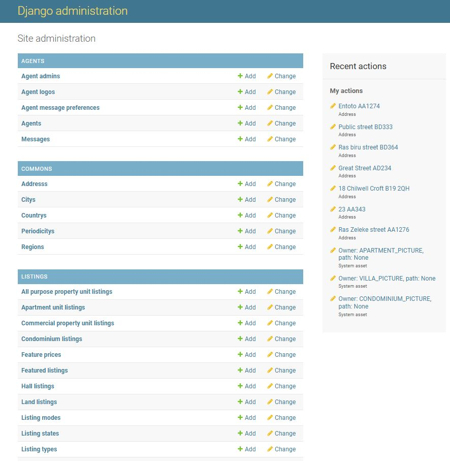

# Backend part of Grinmove property listing website

This is the backend part of the Grinmove online property listing website. The backend developed using Django Rest Framework. It is a collection of REST endpoints that recieve requests from the frontend, process it, save to the DB and reply the response to the frontend back.

# Languages and Frameworks Used

- Django
- Django Rest Framework
- PostgreSQL

## Website [Link Here](https://grinmovefrontend.web.app/)

